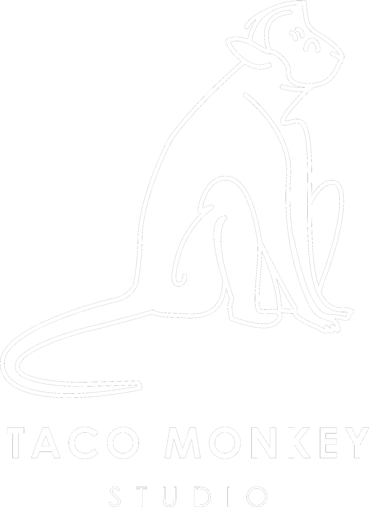

<div align="center">
  <br />
    
  <br />

   <div>
    
    
    
    
    
  </div>

  <h3 align="center">Juan Acevedo — XR Developer</h3>

   <div align="center">
     Immersive experiences, cross-platform XR development, and 3D content creation.
   </div>
</div>

## Table of Contents

1. [About](#about)
2. [Tech Stack](#tech-stack)
3. [Features](#features)
4. [Sections](#sections)
5. [Quick Start](#quick-start)
6. [Links](#links)

## About

I build immersive worlds that push the boundaries of imagination — from WebXR experiences and VR games to interactive 3D applications. Currently working as a Web Developer at Grand Erie District School Board, I bring together frontend engineering, game development, and spatial computing to create experiences that transport users beyond the screen.

## Tech Stack

- **[React](https://react.dev/)** — Component-based UI architecture powering the portfolio with reusable, state-driven modules.
- **[GSAP](https://gsap.com/)** — High-performance animations including SplitText reveals, ScrollTrigger timelines, parallax scrolling, and scroll-synced video playback.
- **[Three.js](https://threejs.org/)** — 3D rendering with a real-time VR headset model, dynamic lighting, and continuous rotation animation.
- **[Tailwind CSS](https://tailwindcss.com/)** — Utility-first styling for responsive, maintainable UI across all screen sizes.
- **[Vite](https://vitejs.dev/)** — Fast build tool with instant HMR and optimized production builds.
- **[Unity](https://unity.com/)** — XR game development with Meta XR Interaction SDK.
- **[WebXR](https://www.w3.org/TR/webxr/)** — Cross-platform XR experiences via Needle Tools.
- **[Sitefinity](https://www.progress.com/sitefinity)** — Enterprise CMS development with .NET Core.

## Features

- **3D VR Headset Model** — Interactive Three.js scene with a rotating GLTF model, dynamic lighting, and responsive sizing.
- **Scroll-Triggered Animations** — GSAP ScrollTrigger powers pinned sections, masked reveals, parallax effects, and staggered text entrances.
- **SplitText Typography** — Character and word-level animations for dynamic title reveals.
- **Scroll-Synced Video** — Hero video playback synced to scroll position for cinematic storytelling.
- **Responsive Design** — Adaptive layouts and animations tailored for mobile and desktop via `react-responsive`.
- **Project Showcase** — Grid layout with linked project cards (Ghost Attack, Tiny Rebels, Mints on the House, Pangea, Soluciones Fino).

## Sections

| Section | Description |
|---------|-------------|
| **Hero** | Animated intro with scroll-driven video, name reveal, and tagline |
| **Tech Stack** | Technologies and frameworks with experience details |
| **About / Work** | Professional experience (Grand Erie DSB, Pagsmile, JAMSOFT) |
| **Projects** | Portfolio projects with live demo links |
| **Virtual Reality** | 3D XR showcase with rotating VR headset model |
| **Passions** | Personal projects — Taco Monkey Studio, La Playa Vision, Mints on the House |
| **Contact** | Social links and contact information |

## Quick Start

**Prerequisites:** Git, Node.js, npm

```bash
# Clone the repository
git clone https://github.com/yourusername/my_portfolio.git
cd my_portfolio

# Install dependencies
npm install

# Start the development server
npm run dev
```

Open [http://localhost:5173](http://localhost:5173) in your browser.

## Links

- **[Taco Monkey Studio](https://www.youtube.com/@TacoMonkeyStudio)** — VR game development
- **[La Playa Vision](https://www.youtube.com/@LaPlayaVision)** — Travel photography
- **[Mints on the House](https://www.youtube.com/@MINTSOnTheHouse)** — House music & art
- **[Ghost Attack](https://tacomonkeystudio.itch.io/ghost-attack)** — VR game
- **[Tiny Rebels](https://tacomonkeystudio.itch.io/tiny-rebels-v11)** — Strategy game
- **[Mints on the House](https://mintsonthehouse.com/)** — Music event site

## Socials

[](https://www.instagram.com/ace340/)
[](https://www.linkedin.com/in/juan-aceved0/)
